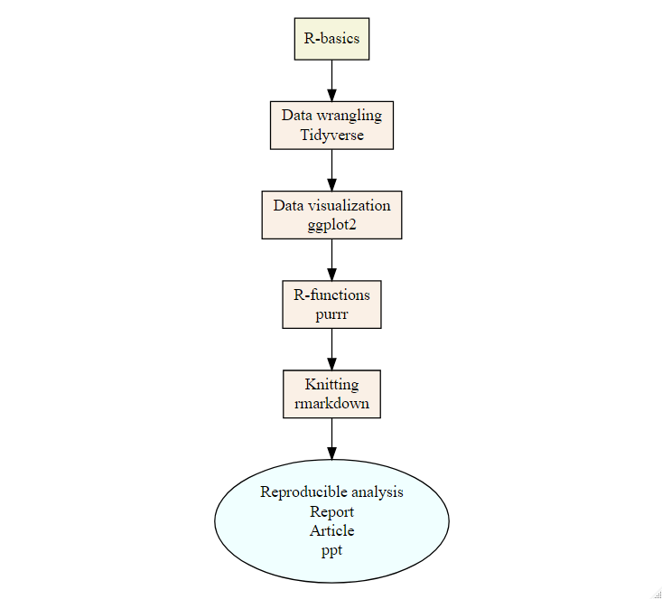

# Day 1
# 1.1. [R-basics](01-1-R-basics.html)

- Course presentation; 
- How to prepare a working directory (rules of good data science);
- File names and type of data files;
- [The R studio IDE](cheatsheets/rstudio-ide.pdf);
- [Reading and Writing Data](cheatsheets/data-import.pdf);
- Scripting; 
- Packages (and GitHub);
- Ask for help;

# 1.2. [Workflow basics](01-2-workflow-basics.html)

- Using the console
- Practice
- Using the scripts
- Practice

# Day 2
# 2. [Data wrangling](02-data-wrangling.html)

- Welcome to the [`Tidyverse`](cheatsheets/data-transformation.pdf); 
- `filter()` #Pick observations by their values
- `arrange()` #Reorder the rows
- `select()` #Pick variables by their names
- `mutate()` #Create new variables with functions of existing variables
- `summarise()` #Collapse many values down to a single summary
- `group_by()` #which changes the scope of each function from the entire dataset to a group
- saving data

#### 2.1. [Fishing effort exercise 1](scripts/fishing-effort-excercise-1.R)

# 3. [Data visualization](03-data-visualization.html)

- Welcome to [ggplot2](cheatsheets/data-visualization-2.1.pdf)
- Exploratory data analysis
- Data visualization

#### 3.1. [Fishing effort exercise 2](scripts/fishing-effort-excercise-2.R)

# Day 3
# 4. [R-functions and iterations](04-iteration-purrr.html)

- R-functions and shortcuts; 
- The [`purrr`](cheatsheets/data-transformation.pdf) package;

# 5. [Knitting](05-rmarkdown.html)

- the [`rmarkdown`](cheatsheets/rmarkdown-2.0.pdf) package; 

---

# Weblinks

### Basics

- R for data science: https://r4ds.had.co.nz
- Modern R dive: https://moderndive.com/index.html
- Data wrangling with R: https://cengel.github.io/R-data-wrangling/
- The Tidyverse style guide: https://style.tidyverse.org/index.html

### Advanced

- Advanced R: https://adv-r.hadley.nz/
- Efficient R programming: https://bookdown.org/csgillespie/efficientR/
- R programming for Data Science: https://bookdown.org/rdpeng/rprogdatascience/
- Hands on programming with R: https://rstudio-education.github.io/hopr/

### Visualization

- Fundamentals of data visualization: https://serialmentor.com/dataviz/
- Interactive animations: https://plotly-r.com/
- Top 50 visualization with R: http://r-statistics.co/Top50-Ggplot2-Visualizations-MasterList-R-Code.html
- The R graph gallery: https://www.r-graph-gallery.com/
- Graphs cookbook: http://www.cookbook-r.com/Graphs/

### Documents creation

- Rmarkdown definitive guide: https://bookdown.org/yihui/rmarkdown/
- Bookdown & blogdown: https://bookdown.org

### Miscellaneous tutorials

- Getting started with R and R-studio: https://ourcodingclub.github.io/2016/11/13/intro-to-r.html
- Coding Club Tutorials: https://ourcodingclub.github.io/tutorials/
- Cleaning and visualizing genomic data: http://varianceexplained.org/r/tidy-genomics/
- R for Reproducible Scientific Analysis: https://swcarpentry.github.io/r-novice-gapminder/
- R-Studio Primers: https://rstudio.cloud/learn/primers

